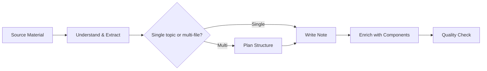

# Obsidian Notes Creator

Transform source material into genuinely excellent study notes — with analogies that make hard things click, diagrams that show structure at a glance, and layouts that scale from a single concept to an entire subject.

## Workflow

---

## Step 1: Understand the Source

Read the source material and identify:
- The **core concepts** (theory, definitions, formulas)
- The **mechanisms** (how things work, algorithms, processes)
- The **tricky parts** (things a student would get confused by)
- Where **analogies and examples** would help most

The tricky parts are the most important — they're where the note earns its value.

---

## Step 2: Decide Scope

**Single note** (one `.md` file) when the topic is self-contained and under ~400 lines.
→ Use template in [`references/structure/single-note.md`](references/structure/single-note.md)

**Multi-file** when the topic has 3+ major sub-concepts, or when sub-concepts are reused by other notes.
→ See rules and folder layouts in [`references/structure/multi-file.md`](references/structure/multi-file.md)
→ Write a hub note last: [`references/structure/index-note.md`](references/structure/index-note.md)

---

## Step 3: Write Content

**Order matters.** Always: motivation → intuition → analogy → formal definition → confirmation.
Never open with a formula. See [`references/writing/intuition-first.md`](references/writing/intuition-first.md).

For every hard concept, choose an analogy pattern:
→ [`references/writing/analogies.md`](references/writing/analogies.md) — 5 patterns: step-down, before/after, object, pseudocode, direction-flip

For every concept, add at least one example:
→ [`references/writing/examples.md`](references/writing/examples.md) — Concept→Example→Variation, Problem→Solution→Why

When two things are similar, compare them immediately:
→ [`references/writing/comparisons.md`](references/writing/comparisons.md) — tables, hierarchy views, similarities + key difference

---

## Step 4: Add Obsidian Components

Use callouts to signal special content (warnings, analogies, tips, questions) — not for decoration:
→ [`references/components/callouts.md`](references/components/callouts.md) — all 13 types with a decision guide

Choose the right diagram type for the content:
→ [`references/components/diagrams.md`](references/components/diagrams.md) — Mermaid (6 types) + ASCII patterns + embedded SVG/PNG for data visuals

Fill frontmatter with tags and date:
→ [`references/components/frontmatter.md`](references/components/frontmatter.md)

Link related notes with wikilinks:
→ [`references/components/wikilinks.md`](references/components/wikilinks.md)

---

## Step 5: Quality Check

Before finishing, run through:
→ [`references/quality-checklist.md`](references/quality-checklist.md)

Key gates: every hard concept has an analogy, every concept has an example, every note has a diagram, callouts are used purposefully, frontmatter is filled.
